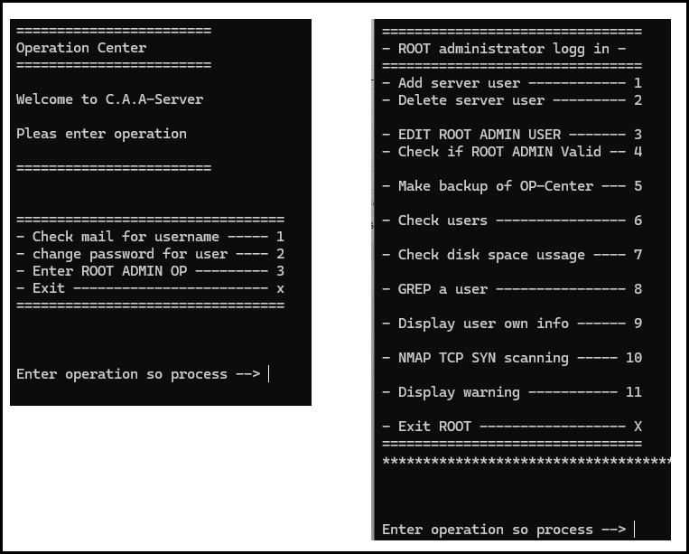

# Operation Center (Bash Project)

A **Bash scripting** project that simulates a *ROOT administrator control center* with login, menus, and modules for common sysadmin operations.  

The project is built in a modular structure: the main script (`root-operation-center`) serves as the core controller.

---

## Features
- **Root check**: The script exits if not run as root (via `id -u`)  
- **Login system**: Simulated admin login with username and password stored in `admin_credentials.txt`  
- **Menu-based interface** (using `case`) with options such as:
  - Add user  
  - Delete user  
  - Edit root-admin user  
  - Verify root-admin validity  
  - System backup  
  - Show all users  
  - Disk space check  
  - Grep for a specific user  
  - Display user info  
  - NMAP TCP SYN scan  
  - Show notifications (Zenity)  
  - Exit the root center  

---

## Technology
- **Bash** as the main scripting language  
- Modular structure using external scripts (e.g., `./add_root`, `./delete-user`)  
- Use of `case` for handling menu selections  
- Simple **login mechanism** using a text file with username and password  
- Basic "2FA-like" verification through an additional check (`verify_root_check`)  

---

### Example
